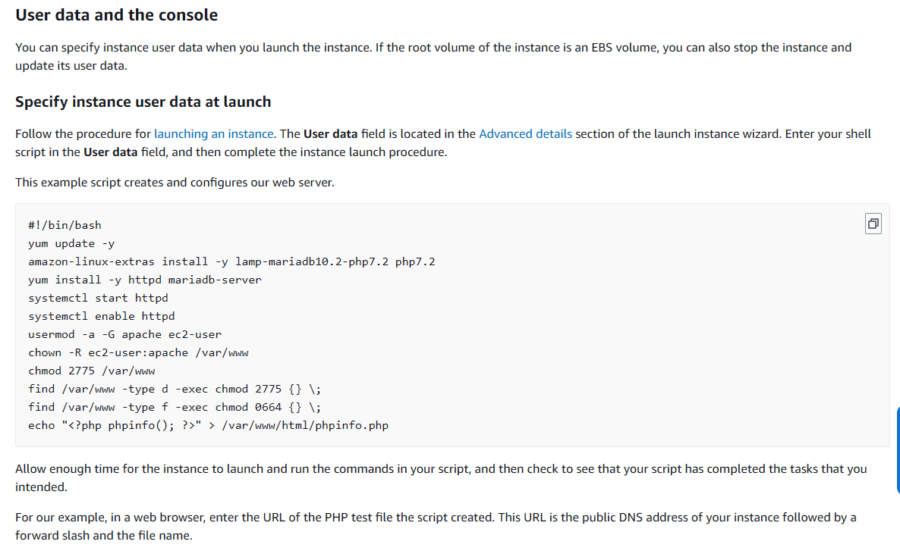
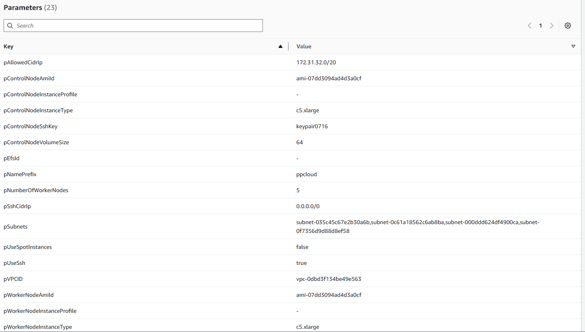
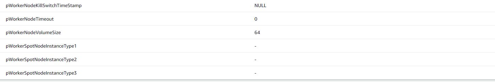

https://github.com/DOI-USGS/cloud-ht2c/blob/main/docs/1-create-base-image.md

creating new ami

#use the following aws ami with htcondor already installed  
**ami-0df24e148fdb9f1d8**


## on the instance possibly set the user as ec2-user

Do this  if you want to run conda/python with local install. if using conda-pack, it is not necessary. 

https://docs.aws.amazon.com/AWSEC2/latest/UserGuide/user-data.html#user-data-shell-scripts
https://repost.aws/questions/QUj7XEk_sfRMeZLlxRCoJpcQ/run-shell-script-as-ec2-user-on-cloud-formation-user-data



## under user data set the following startup script?
sudo -u ec2-user  -i <<'EOF'  
cd /home/ec2-user  
EOF  

#install miniconda
https://docs.anaconda.com/miniconda/#quick-command-line-install

These four commands quickly and quietly install the latest 64-bit version of the installer and then clean up after themselves. To install a different version or architecture of Miniconda for Linux, change the name of the .sh installer in the wget command.

`mkdir -p ~/miniconda3 `   
`wget https://repo.anaconda.com/miniconda/Miniconda3-latest-Linux-x86_64.sh -O ~/miniconda3/miniconda.sh`      
`bash ~/miniconda3/miniconda.sh -b -u -p ~/miniconda3`    
`rm -rf ~/miniconda3/miniconda.sh ` 

`~/miniconda3/bin/conda init bash  `  
`~/miniconda3/bin/conda init zsh  `


if necessary:  
`conda install -c anaconda git`

`git clone https://github.com/andyrich/pestrun2024.git`


# after installing
close and reopen 

`conda env create  -f  pestrun2024/setup.yml  `
#install htcondor via python?  
`conda install -c conda-forge python-htcondor ` 

# initialize a submit object from a python dict  
note that values should be strings  
`mydict = {
    "executable": "/bin/sleep",
    "arguments": "5s",
    "log": "$(ClusterId).log",
    "My.CustomAttribute": classad.quote("foobar"),
}  
from_dict = htcondor.Submit(mydict)  `


# install ansible
change to root  
`sudo su  `

`yum install -y ansible  `  

`ansible-pull -U https://github.com/DOI-USGS/cloud-ht2c.git -i localhost htcondor-al2023/ansible/playbook.yml`

 to check the ansible configuration using a particular git repo branch:    
`ansible-pull -U https://github.com/DOI-USGS/cloud-ht2c.git -i localhost htcondor-al2023/ansible/playbook.yml --check --checkout 2-bring-into-parity-with-chs-stack
`

how to execute file in linux:  
`sudo chmod +x mf-owhm.nix  `

# to install pest:  
`import pyemu  `
# Or use an auto-select option  
`pyemu.utils.get_pestpp(":python")  `

# to run model file  
`chmod +x run.sh  `  
`./run.sh  `

# to install condor
https://htcondor.readthedocs.io/en/latest/getting-htcondor/install-linux-as-user.html  

## to start condor   
`. ~/condor/condor.sh`

### check if condor is running
```bash
condor_master
condor_status
```


# how to install conda-pack
[conda-pack Documentation](https://conda.github.io/conda-pack/)

```bash
conda install conda-pack  
conda install -c conda-forge conda-pack
```

### Pack environment my_env into my_env.tar.gz
```bash
conda pack -n my_env
```

### On the target machine

### Unpack environment into directory `my_env`
```bash
mkdir -p my_env
tar -xzf my_env.tar.gz -C my_env
```

### Use python without activating or fixing the prefixes. Most python
### libraries will work fine, but things that require prefix cleanups will fail.  
```bash
./my_env/bin/python
```

### Activate the environment. This adds `my_env/bin` to your path
```bash
source my_env/bin/activate
```

### Run python from in the environment
```bash
(my_env) $ python
```

### Cleanup prefixes from in the active environment.
### Note that this command can also be run without activating the environment
### as long as some version of python is already installed on the machine.
```bash
(my_env) $ conda-unpack
```


# model files 
upload zipped directory to google drive (eg pestaws)
this will be downloaded via curl, then unzipped.
the unzipped version will be used in master directory, the zipped version will be sent to each slave


## to download a file from google drive, use the following
1E8URF78HnwjvrqlRhs9-yWmnRZ2oppKl

curl -L "https://drive.usercontent.google.com/download?id=1SEWk-Iug6XegXBGJmsW-w0GyWvDv4y-l&confirm=xxx" -o data.zip  

https://drive.google.com/file/d/1SEWk-Iug6XegXBGJmsW-w0GyWvDv4y-l/view?usp=drive_link

## to unzip the file (silently)
unzip -q data.zip


## AMI id for 07/16
	
ami-07dd3094ad4d3a0cf  



## to open stack:
may need to be edited before running
https://us-west-2.console.aws.amazon.com/cloudformation/home?region=us-west-2#/stacks/quickcreate?templateURL=https%3A%2F%2Fs3.us-west-2.amazonaws.com%2Fcf-templates-1mlwdo4ihaz0m-us-west-2%2F2024-07-19T201837.692Z632-htcondor-al2023.yml&stackName=fatstack&param_pAllowedCidrIp=172.31.32.0%2F29&param_pControlNodeSshKey=&param_pWorkerNodeInstanceProfile=&param_pControlNodeInstanceType=c5.xlarge&param_pNamePrefix=fsp&param_pWorkerNodeVolumeSize=64&param_pUseSpotInstances=false&param_pEfsId=&param_pWorkerNodeAmiId=ami-07dd3094ad4d3a0cf&param_pWorkerSpotNodeInstanceType2=&param_pWorkerSpotNodeInstanceType1=&param_pWorkerSpotNodeInstanceType3=&param_pSubnets%5B%5D=subnet-035c45c67e2b30a6b&param_pSubnets%5B%5D=subnet-0c61a18562c6ab8ba&param_pSubnets%5B%5D=subnet-000ddd624df4900ca&param_pSubnets%5B%5D=subnet-0f7356d9d88d8ef58&param_pControlNodeVolumeSize=64&param_pControlNodeInstanceProfile=&param_pWorkerNodeInstanceType=c5.xlarge&param_pControlNodeAmiId=ami-07dd3094ad4d3a0cf&param_pWorkerNodeTimeout=0&param_pVPCID=vpc-0dbd3f134be49e563&param_pWorkerNodeKillSwitchTimeStamp=NULL&param_pUseSsh=true&param_pNumberOfWorkerNodes=2&param_pSshCidrIp=0.0.0.0%2F0